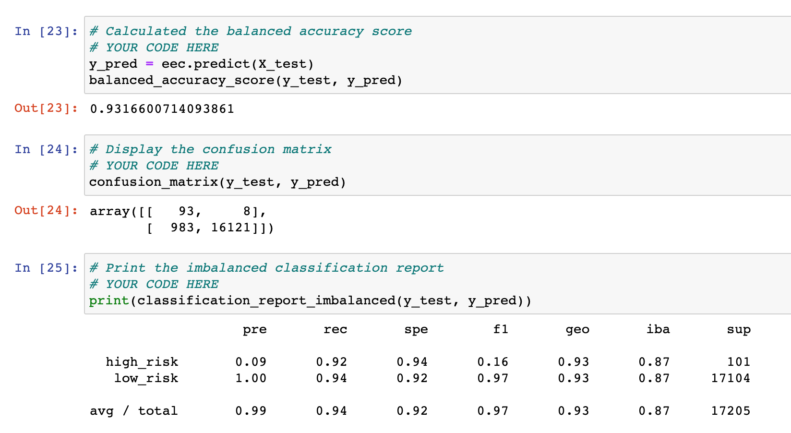

# Credit Risk Analysis
The goal of this project is to process credit risk data using different machine learning models and recommend a model.

# Overview

Using the credit card credit dataset from LendingClub, a peer-to-peer lending services company, different machine learning models were examined to identify which model provided the maximum accuracy.

## Results 

### Naive Random Oversampling

- Accuracy is 0.6359889760023711
- Precision is 0.99. 0.01 for high-risk and 1.0 for low-risk
- Recall is 0.59. 0.68 is for high-risk and 0.59 is for low-risk

### SMOTE Oversampling

- Accuracy is 0.662394124702461
- Precision is 0.99. 0.01 for high-risk and 1.0 for low-risk
- Recall is 0.40. 0.69 is for high-risk and 0.40 is for low-risk

### Undersampling

- Accuracy is 0.5447339051023905
- Precision is 0.99. 0.01 for high-risk and 1.0 for low-risk
- Recall is 0.59. 0.68 is for high-risk and 0.59 is for low-risk

### Combination (Over and Under) Sampling

- Accuracy is 0.6427620428085838
- Precision is 0.99. 0.03 for high-risk and 1.0 for low-risk
- Recall is 0.58. 0.70 is for high-risk and 0.58 is for low-risk

### Balanced Random Forest Classifier

- Accuracy is 0.7885466545953005
- Precision is 0.99. 0.01 for high-risk and 1.0 for low-risk
- Recall is 0.87. 0.70 is for high-risk and 0.87 is for low-risk

### Easy Ensemble AdaBoost Classifier

- Accuracy is 0.99
- Precision is 0.99. 0.09 for high-risk and 1.0 for low-risk
- Recall is 0.94. 0.92 is for high-risk and 0.94 is for low-risk

## Summary  
The recommendation is to use Easy Ensemble AdaBoost Classifer model as it provided:
- Accuracy: 0.99 (best = 1, worst = 0). All other models provided accuracy less than 0.79
- Precision: precision is same for all models
- Recall: 0.94 (best = 1, worst = 0). All other models provided recall value less than 0.88
